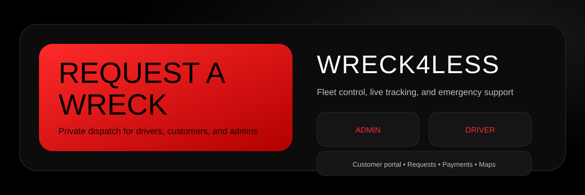



# Wreck4Less

Private dispatch platform for towing operations with dedicated experiences for customers, drivers, and admins. Built with Jetpack Compose and a FastAPI backend, Wreck4Less delivers live tracking, role-based access, dispatch management, and emergency support in a bold red-and-black interface.

## Highlights

- Role-based portals: Customer, Driver, Admin
- Secure authentication with JWT and server-side password hashing
- Dispatch lifecycle: request → approval → payment → tracking
- Live location and map views (OSMDroid)
- Driver online/offline state and nearby job discovery
- Admin job management, reassignment, and export tools
- Emergency support and quick-call access

## Roles & Capabilities

**Customer**
- Request a wreck with required details and images
- Track active jobs and view job history
- Add a card and choose payment method
- Access emergency contacts

**Driver**
- Toggle online/offline availability
- View active assignment and status controls
- See nearby requests and past jobs
- Message admin or customer

**Admin**
- View all requests, active dispatches, and completed jobs
- Manage and reassign jobs
- Review driver roster and online status
- Export logs and audit activity

## Tech Stack

- Android: Kotlin, Jetpack Compose, Material 3
- Backend: FastAPI, PostgreSQL, psycopg2, JWT
- Maps: OSMDroid (OpenStreetMap)

## Project Structure

- `app/` Android client
- `backend/` FastAPI server
- `database/` SQL schema
- `docs/` assets (banner, screenshots)

## Maps

OSMDroid is used for all map screens (customer tracking, admin map, driver map, nearby requests). OpenStreetMap tiles are free and do not require an API key.

## Security Notes

- Passwords are hashed server-side (PBKDF2)
- JWT tokens for authenticated sessions
- Role-based access enforced on the server
- Parameterized SQL for all DB access

## Screenshots

Add your latest screenshots to `docs/` and link them here for a polished presentation.

---

Built for bold dispatch operations. Red means ready.
